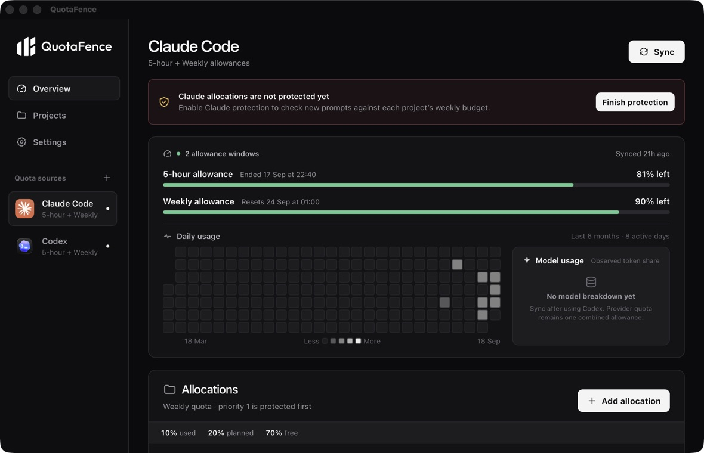
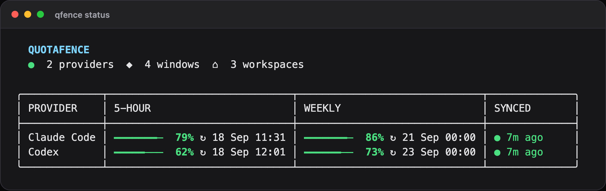
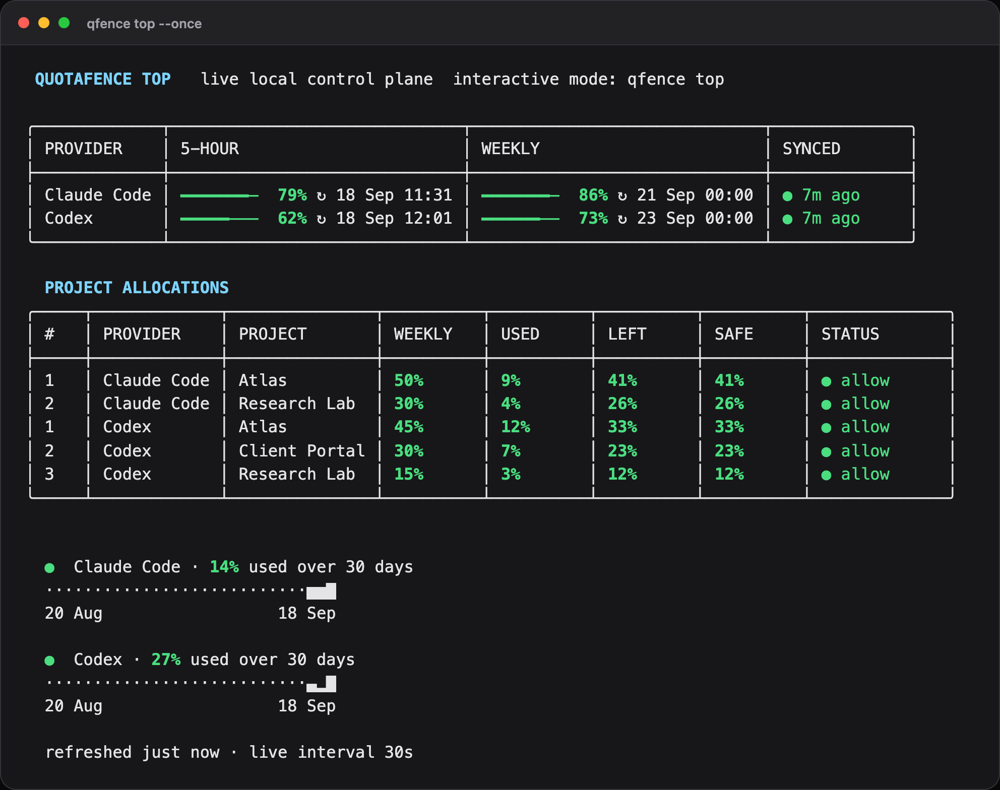
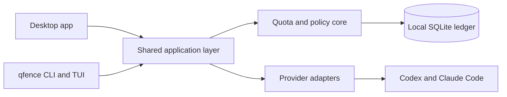

<div align="center">
  
  <h1>QuotaFence</h1>
  <p><strong>Local-first quota management for Codex and Claude Code.</strong></p>
  <p>Track 5-hour and weekly allowances, assign weekly budgets to project folders, and protect important work before shared quota runs out.</p>

  [](https://www.npmjs.com/package/@quotafence/cli)
  [](https://github.com/quotafence/quotafence/releases)
  [](https://github.com/quotafence/quotafence/actions/workflows/ci.yml)
  [](LICENSE)

  <a href="https://quotafence.com">Website</a> ·
  <a href="https://quotafence.com/docs/">Documentation</a>
</div>

QuotaFence is an open-source desktop app and terminal UI for people who run AI
coding agents across several projects. It keeps its ledger on your device and
does not upload prompts, source code, transcripts, or provider credentials.

> [!IMPORTANT]
> QuotaFence `0.x` is an early release. Desktop installers are not notarized or
> production-signed yet. Read the [installation notes](docs/installing.md)
> before bypassing Gatekeeper or SmartScreen.

<p align="center">
  
  <br />
  <sub>Desktop dashboard shown with synthetic demo data.</sub>
</p>

## Start in 60 seconds

Install the CLI and interactive terminal dashboard:

```bash
npm install --global @quotafence/cli
qfence sync
qfence top
```

<p align="center">
  
</p>

Inside `qfence top`, use `a` to give the current project a weekly budget. Or do
the same directly from the shell:

```bash
cd ~/Code/my-important-project
qfence allocations add --provider codex --percent 30
qfence codex
```

That creates a 30% Codex weekly budget for the current folder, then launches a
managed Codex session using the same local policy and ledger.

Prefer a graphical interface? Download the desktop app from
[GitHub Releases](https://github.com/quotafence/quotafence/releases).

## Why QuotaFence exists

Codex and Claude Code expose account-level allowances. Those shared limits do
not tell you how much capacity each project should receive, and one background
task can consume quota you wanted to keep for more important work.

QuotaFence adds a local control layer:

1. **Observe** the provider's 5-hour and weekly allowance windows.
2. **Allocate** a share of weekly quota to each project folder.
3. **Prioritize** which project budgets stay protected as capacity falls.
4. **Enforce** local Warn and Stop policies for managed sessions and verified
   provider hooks.
5. **Review** basic usage history without sending project data to a cloud
   service.

## What you get

| Capability | Desktop | CLI / TUI |
| --- | :---: | :---: |
| Codex and Claude Code allowance tracking | ✓ | ✓ |
| 5-hour and weekly reset times | ✓ | ✓ |
| Weekly budgets for local project folders | ✓ | ✓ |
| Add, resize, remove, and reprioritize allocations | ✓ | ✓ |
| Local Warn and Stop policies | ✓ | ✓ |
| Basic local usage history | ✓ | ✓ |
| Managed Codex and Claude Code launches | — | ✓ |
| Verified desktop prompt protection | ✓ | — |

There is no project-count paywall in the open-source core.

## How project budgets work

An allocation is a percentage of the provider's **full weekly allowance**, not
a percentage of whatever remains at the moment you create it. The 5-hour window
stays an account-wide safety limit.

If current provider capacity can no longer fund every target, QuotaFence
protects higher-priority projects first. It can refuse a new managed launch or
a new prompt seen by a verified hook. It does not claim to terminate work that
is already running.

Managed sessions can be attributed directly. Desktop attribution uses minimal
local activity metadata and only assigns provider movement when the active
folder is unambiguous. Concurrent or unmapped usage remains unattributed rather
than being guessed.

Read [How QuotaFence models quota](docs/quota-model.md) for the full model.

## Install the desktop app

| Platform | Package | Current support |
| --- | --- | --- |
| macOS Apple silicon and Intel | Universal `.dmg` | Supported; ad-hoc signed, not notarized |
| Windows x64 | NSIS installer | Preview; unsigned |
| GNU/Linux x64 | AppImage and Debian package | Preview; unsigned |

ARM64 Windows/Linux and musl/Alpine packages are not published yet.

1. Download the package for your OS from
   [GitHub Releases](https://github.com/quotafence/quotafence/releases).
2. Open QuotaFence and add the detected Codex or Claude Code source.
3. Sync once and compare the allowance values with the provider.
4. Add a project folder and assign its weekly budget.
5. To protect desktop prompts, open the matching provider tab in
   **Settings**, enable the integration, then follow the verification steps.

Newly installed hooks cannot attach to tasks that were already open. Start a
new task, send one prompt, then use **Check now** in QuotaFence.

See the [complete installation guide](docs/installing.md) for checksums,
Gatekeeper, SmartScreen, upgrades, PATH configuration, and removal.

## Provider support

| Provider | Allowance sync | Weekly project budgets | Managed CLI | Desktop prompt gate |
| --- | --- | --- | --- | --- |
| Codex | 5-hour + weekly | Available | Available | Available |
| Claude Code | 5-hour + weekly | Available | Available | Available |

Availability depends on the provider client, account type, and windows returned
for that account. QuotaFence does not turn context-window usage into subscription
usage or invent a provider window that is missing.

## Everyday CLI commands

`qfence` is the recommended command. `quotafence` is an equivalent alias.

```bash
qfence status              # refresh and show current allowances
qfence sync                # force a provider refresh
qfence top                 # open the interactive terminal dashboard
qfence history             # show basic local usage history
qfence allocations         # list weekly project budgets
qfence here                # show the current folder mapping
qfence codex               # launch Codex with quota protection
qfence claude              # launch Claude Code with quota protection
```

Manage allocations without opening the desktop app:

```bash
qfence allocations add --provider claude --percent 20
qfence allocations set "Client project" --percent 30 --from "Main project"
qfence allocations move "Client project" up
qfence allocations remove "Client project" --provider claude
```

<p align="center">
  
</p>

Run `qfence help` or read the [CLI and TUI guide](docs/cli.md) for every command
and keyboard shortcut.

### Install without npm

Extract the matching `quotafence-cli-*` archive from GitHub Releases. On macOS
or Linux:

```bash
./install-cli.sh ./qfence
```

On Windows, run `install-cli.ps1` from PowerShell. A Homebrew tap is not
available yet.

## Privacy and security boundary

QuotaFence stores its configuration, provider checkpoints, project mappings,
allocations, policy decisions, and basic usage history in a local SQLite
database. It does **not** intentionally collect or upload:

- prompts or assistant responses;
- source files or repository contents;
- conversation transcripts;
- provider credentials; or
- the QuotaFence database.

Provider authorization material needed for a refresh is used in memory and is
not persisted by QuotaFence. The current open-source release does not require a
QuotaFence account or cloud backend.

Read [Security](SECURITY.md), [Local storage](docs/storage.md), and the
[provider capability matrix](docs/provider-capability-matrix.md) for details.

## Honest limitations

- Desktop installers are not production-signed or notarized.
- Windows and Linux are currently x64 Preview targets.
- Providers do not expose exact subscription-token usage by project.
- External, concurrent, or unmapped activity may remain unattributed.
- Hook protection applies to new prompts; it cannot stop an in-flight turn.
- Automatic updates, cloud sync, teams, billing, and automatic agent switching
  are not implemented in `v0.1.1`.

If something looks wrong, use the matching form under
[New issue](https://github.com/quotafence/quotafence/issues/new/choose). Never
attach credentials, prompts, transcripts, source code, or the local database.

## Build from source

Prerequisites:

- Node.js 22 or newer;
- npm 10 or newer;
- the stable Rust toolchain; and
- the [Tauri 2 prerequisites](https://v2.tauri.app/start/prerequisites/) for
  your operating system.

```bash
git clone https://github.com/quotafence/quotafence.git
cd quotafence
npm install
npm run tauri -- dev
```

Run the CLI from source:

```bash
npm run qfence -- status
npm run qfence -- top
```

Validate a change with `npm run check`. Windows contributors should also read
the [Windows guide](docs/windows.md); Linux contributors should read the
[Linux guide](docs/linux.md).

## Architecture



The desktop app and CLI share the same Rust application, provider, policy, and
storage layers. QuotaFence is currently a modular monolith and does not require
a daemon or hosted service.

## Documentation

Start with the hosted [QuotaFence documentation](https://quotafence.com/docs/)
for installation and everyday use. The repository guides below provide the
same operational details alongside contributor and architecture references.

| Guide | Start here when… |
| --- | --- |
| [Installation](docs/installing.md) | You want to install, upgrade, verify, or remove QuotaFence |
| [CLI and TUI](docs/cli.md) | You want all commands and keyboard shortcuts |
| [Quota model](docs/quota-model.md) | You want to understand budgets and priority |
| [Provider capabilities](docs/provider-capability-matrix.md) | You want exact Codex/Claude behavior |
| [Windows](docs/windows.md) | You use or build on Windows |
| [Linux](docs/linux.md) | You use or build on Linux |
| [Architecture](docs/architecture.md) | You want to contribute to the codebase |
| [Roadmap](docs/roadmap.md) | You want to see what is planned next |

## Open-source core and future Pro features

Project budgets, local enforcement, provider adapters, basic history, and the
desktop/terminal dashboards are part of the Apache-2.0 open-source core. The
planned commercial layer is for workflow conveniences such as advanced
analytics, forecasting, automation, and optional multi-device or team
coordination—not a project-count paywall.

See [Product direction](docs/product-and-monetization.md) and
[Licensing](docs/licensing.md).

## Contributing and license

Read [CONTRIBUTING.md](CONTRIBUTING.md) before opening a large change. Report
security issues privately through [SECURITY.md](SECURITY.md).

QuotaFence is licensed under the [Apache License 2.0](LICENSE). Codex, OpenAI,
Claude, Anthropic, and their associated marks belong to their respective
owners. QuotaFence is independent and is not affiliated with or endorsed by
those providers.
