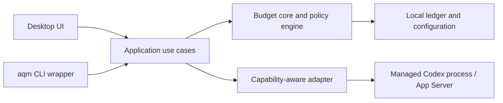

# Agent Quota Manager

Local-first budget guard and routing layer for AI coding agents.

> [!IMPORTANT]
> Agent Quota Manager is an early local MVP with no stable release. Codex quota
> discovery, checkpoint refresh, reset rollover, and manual allocations work
> locally. Folder-based workspace mapping plus `aqm context` and the provider-refreshing
> `aqm admit codex` dry run are implemented. Managed sessions, automatic
> attribution, and enforcement at launch are not implemented yet.

Solo power users often run several coding agents across multiple workspaces
against the same constrained subscription. Low-priority work can exhaust that
shared capacity before important work starts, while provider dashboards cannot
usually explain which workspace consumed it or enforce a project budget.

Agent Quota Manager (AQM) aims to protect capacity for important work, attribute
managed usage to local folder workspaces, and apply policy before or during
work when the provider integration can honestly support it.

## What it is

AQM is intended to become a local control layer between a user and installed AI
coding agents. The lightweight daily workflow should be a wrapper such as:

```bash
aqm run codex
```

That workflow will:

- resolve the current folder to a workspace allocation;
- reserve capacity for the requested work;
- warn, require confirmation, or refuse admission at a policy boundary;
- run a provider session under AQM management; and
- reconcile the resulting provider usage back to the workspace.

The desktop UI remains useful for setup and policy visibility, but dashboard
analytics alone are not the product. Longer term, the same control layer may
route work using provider quota, credit, cost, concurrency, priority, and
deadline. Those dimensions are not assumed to be interchangeable.

## Product principles

- **Protect important work:** reserve scarce capacity before lower-priority work
  consumes it.
- **Automatic attribution:** managed sessions should not depend on manual usage
  entry.
- **Policy in the path:** enforcement belongs in the launch workflow, not only
  on a dashboard.
- **Capability honesty:** never claim a hard stop outside sessions AQM controls
  or without a usable signal.
- **Local first:** policy, attribution, workspace metadata, and session records
  stay on the device.
- **Codex first:** complete one end-to-end adapter before adding more providers.

## Codex v0.1 vertical slice

| Area | Initial scope |
| --- | --- |
| Provider | Codex |
| Context | Map any local folder to a workspace allocation |
| Workflow | `aqm run codex` or an equivalent lightweight managed launch |
| Sessions | Reserve, start, observe, finish, and recover one managed session |
| Enforcement | Warn, confirm, or refuse launch according to effective capability |
| Accounting | Automatic session attribution plus provider reconciliation |
| Forecasting | Evidence-based depletion signal after reliable attribution |
| Storage | Local database; no hosted account required |

Additional providers, cloud sync, teams, RBAC, billing, and routing are outside
the current slice. See the [Roadmap](docs/roadmap.md) for implementation gaps,
milestones, and recommended architecture decisions.

## Architecture at a glance



The first release remains a modular monolith. The CLI and desktop should reuse
the same Rust application layer; a daemon is deferred until concurrent clients
or background lifecycle management justify it. See
[Architecture](docs/architecture.md),
[Quota model](docs/quota-model.md), and
[Provider adapters](docs/provider-adapters.md). The implemented SQLite layer is
described in [Storage](docs/storage.md), and use-case orchestration in
[Application services](docs/application-services.md). The desktop IPC contract
is documented in [Tauri commands](docs/tauri-commands.md), and folder-based
workspace binding in the [AQM CLI guide](docs/cli.md). See
[Local MVP](docs/local-mvp.md) for the current implemented baseline.

### Codex detection

When Codex is installed and signed in with a ChatGPT subscription, onboarding
starts its official local App Server and calls `account/rateLimits/read`. The
adapter imports the selected quota window, reset time, normalized percentage,
and current provider-confirmed usage. Manual setup remains available when
detection is unsupported or temporarily unavailable.

The app does not read Codex credential files, session transcripts, prompts, or
workspace contents. The App Server process is stopped after the snapshot is
read. The selected Codex source refreshes on startup and on demand. Provider
totals replace the previous snapshot rather than accumulating as usage events,
and a new reset window carries allocations forward without old usage.

## Development

### Prerequisites

- Node.js 22 or newer
- npm 10 or newer (included with Node.js)
- stable Rust toolchain
- Tauri 2 platform prerequisites for your operating system

### Run locally

```bash
npm install
npm run tauri -- dev
```

### Validate a change

```bash
npm run check
```

This builds the frontend, checks Rust formatting and compilation, runs Clippy
with warnings denied, and runs the Rust tests.

### Resolve or bind the current workspace

Choose a folder and create a workspace allocation in the desktop app, or bind
an existing top-level allocation from the CLI:

```bash
npm run aqm -- context
npm run aqm -- bind --scope "Workspace allocation name"
```

Preview the current policy boundary without launching Codex:

```bash
npm run aqm -- admit codex
```

These development commands use the same local database as the desktop.
Admission refreshes the matching Codex checkpoint and evaluates both workspace
allocation and provider capacity. See the [CLI guide](docs/cli.md) for its exit
codes, explicit confirmation override, JSON, path, and isolated-database
options.

## Contributing

The project is early, so design changes are easiest to discuss before a large
implementation. Read [CONTRIBUTING.md](CONTRIBUTING.md) before opening a pull
request. Please report vulnerabilities according to [SECURITY.md](SECURITY.md).

## License

Licensed under the [Apache License 2.0](LICENSE).
