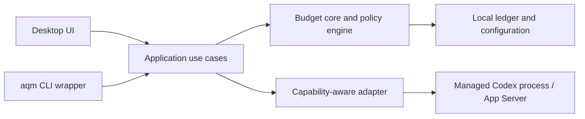

# Agent Quota Manager

Local-first budget guard and routing layer for AI coding agents.

> [!IMPORTANT]
> Agent Quota Manager is an early local MVP with no stable release. Codex quota
> discovery, checkpoint refresh, reset rollover, and manual allocations work
> locally. Folder-based workspace mapping plus `aqm context` and the provider-refreshing
> `aqm admit codex` dry run are implemented. `aqm run codex` now admits,
> reserves, launches, supervises, reconciles, and recovers one managed Codex
> session.
> Desktop refresh can also read Codex's local thread usage metadata and infer
> a workspace's aggregate quota change without requiring the CLI wrapper or
> parsing prompts and transcripts. Aggregate percentage checkpoints still
> cannot provide exact per-workspace token counts or prove causality when
> activity spans multiple or unmapped folders.
> An optional trusted `UserPromptSubmit` hook can block new Codex Desktop
> prompts from folders without an allocation and enforce the allocated
> workspace boundary. It does not terminate an already-running turn.
> Workspace targets are shares of the full quota window. Drag-and-drop priority
> decides which targets are protected first when the current window no longer
> has enough capacity to fund all of them.

Solo power users often run several coding agents across multiple workspaces
against the same constrained subscription. Low-priority work can exhaust that
shared capacity before important work starts, while provider dashboards cannot
usually explain which workspace consumed it or enforce a project budget.

Agent Quota Manager (AQM) aims to protect capacity for important work, attribute
managed usage to local folder workspaces, and apply policy before or during
work when the provider integration can honestly support it.

## What it is

AQM is a local control layer between a user and installed AI coding agents. The
lightweight daily workflow starts with:

```bash
aqm run codex
```

That workflow now:

- resolves the current folder to a workspace allocation;
- reserves capacity for the requested work;
- warns, requires confirmation, or refuses admission at a policy boundary;
- runs a Codex process under AQM management; and
- refreshes the provider checkpoint after exit and attributes an unambiguous
  observed delta to the workspace.

On Unix, the next managed invocation also recovers sessions orphaned by a
crashed supervisor. When AQM observes concurrent Codex work in the same quota
window, the aggregate delta remains unattributed. Each folder can persist its
own warn, confirmation, and stop thresholds; both the desktop and CLI resolve
that override before falling back to the application defaults.

The dashboard derives a conservative managed burn rate from reconciled sessions
in the current window. It shows a depletion signal only after at least two
trustworthy samples, one hour of observation, and 50% attribution coverage.
Sparse or mostly unattributed history stays explicitly “insufficient” instead
of producing a precise-looking ETA.

Allocation targets remain stable even when created mid-window. For example, a
20% target created with only 12% provider quota left can fund 12% now and
becomes fully funded after reset. Reordering folders changes which target is
funded first without rewriting usage or allocation amounts. The UI calls that
funding **planned** until it observes the Codex prompt gate working; only then
does it describe the capacity as protected.

The desktop UI remains useful for setup and policy visibility, but dashboard
analytics alone are not the product. Longer term, the same control layer may
route work using provider quota, credit, cost, concurrency, priority, and
deadline. Those dimensions are not assumed to be interchangeable.

## Product principles

- **Protect important work:** reserve scarce capacity before lower-priority work
  consumes it.
- **Automatic attribution:** managed sessions should not depend on manual usage
  entry.
- **Policy in the path:** enforcement belongs in the launch workflow, not only
  on a dashboard.
- **Capability honesty:** distinguish managed process control, trusted
  pre-prompt admission, and observation-only tracking.
- **Local first:** policy, attribution, workspace metadata, and session records
  stay on the device.
- **Codex first:** complete one end-to-end adapter before adding more providers.

## Codex v0.1 vertical slice

| Area | Initial scope |
| --- | --- |
| Provider | Codex |
| Context | Map any local folder to a workspace allocation |
| Workflow | `aqm run codex` or an equivalent lightweight managed launch |
| Sessions | Reserve, start, observe, finish, and recover one managed session |
| Enforcement | Refuse managed launches or trusted Desktop prompts at allocation boundaries |
| Accounting | Automatic session attribution plus provider reconciliation |
| Forecasting | Evidence-based depletion signal after reliable attribution |
| Storage | Local database; no hosted account required |

Additional providers, cloud sync, teams, RBAC, billing, and routing are outside
the current slice. See the [Roadmap](docs/roadmap.md) for implementation gaps,
milestones, and recommended architecture decisions.

## Architecture at a glance



The first release remains a modular monolith. The CLI and desktop should reuse
the same Rust application layer; a daemon is deferred until concurrent clients
or background lifecycle management justify it. See
[Architecture](docs/architecture.md),
[Quota model](docs/quota-model.md), and
[Provider adapters](docs/provider-adapters.md). The implemented SQLite layer is
described in [Storage](docs/storage.md), and use-case orchestration in
[Application services](docs/application-services.md). The desktop IPC contract
is documented in [Tauri commands](docs/tauri-commands.md), and folder-based
workspace binding in the [AQM CLI guide](docs/cli.md). See
[Local MVP](docs/local-mvp.md) for the current implemented baseline.

### Codex detection

When Codex is installed and signed in with a ChatGPT subscription, onboarding
starts its official local App Server and calls `account/rateLimits/read`. The
adapter imports the selected quota window, reset time, normalized percentage,
and current provider-confirmed usage. Manual setup remains available when
detection is unsupported or temporarily unavailable.

Quota detection does not read Codex credential files, session transcripts,
prompts, or workspace contents. The App Server process is stopped after the
snapshot is read. The selected Codex source refreshes on startup and on demand.
Provider totals replace the previous snapshot rather than accumulating as usage
events, and a new reset window carries allocations forward without old usage.

Each desktop Codex refresh also opens Codex's local state database read-only and
selects only thread ID, working folder, cumulative token counter, and update
time. AQM does not select titles, previews, prompts, responses, or transcript
contents. The first scan establishes a baseline. Later token-counter movement
is used only as evidence of which folder was active; the amount charged remains
the account-wide provider percentage delta. A delta is assigned only when all
observed activity resolves to one mapped workspace. Multiple or unmapped
folders remain unattributed.

This passive path works with ordinary Codex Desktop tasks and requires no hook
installation. It runs at desktop startup and explicit refresh. The lifecycle
hook integration remains available as an experimental, higher-frequency
alternative.

## Development

### Prerequisites

- Node.js 22 or newer
- npm 10 or newer (included with Node.js)
- stable Rust toolchain
- Tauri 2 platform prerequisites for your operating system

### Run locally

```bash
npm install
npm run tauri -- dev
```

### Validate a change

```bash
npm run check
```

This builds the frontend, checks Rust formatting and compilation, runs Clippy
with warnings denied, and runs the Rust tests.

### Resolve or bind the current workspace

Choose a folder and create a workspace allocation in the desktop app, or bind
an existing top-level allocation from the CLI:

```bash
npm run aqm -- context
npm run aqm -- bind --scope "Workspace allocation name"
```

Preview the current policy boundary without launching Codex:

```bash
npm run aqm -- admit codex
```

Inspect or customize the bound folder's managed-session policy:

```bash
npm run aqm -- policy show
npm run aqm -- policy set --warn 75 --confirm 90 --stop 100
npm run aqm -- policy reset
```

Launch a managed Codex session from an allocated folder:

```bash
npm run aqm -- run codex
```

Codex arguments must follow `--`, for example
`npm run aqm -- run codex -- --model gpt-5`. The wrapper reserves the
workspace's current spendable capacity, refuses a stop boundary, forwards
termination signals, preserves the Codex exit code, and releases its
reservation on completion, failure, or interruption.

Enable Codex Desktop workspace protection from Settings, or install it
with the development CLI:

```bash
npm run aqm -- hooks install codex
```

Codex requires non-managed hooks to be reviewed and trusted. See the
[CLI guide](docs/cli.md) for the trust step, current precision limits, status,
and uninstall command. Settings can turn protection on or off without
changing unrelated Codex hooks, distinguishes a complete current configuration
from a stale or partial one, and shows recent allow/block decisions. Once
active, an unallocated folder receives a blocked prompt instead of consuming
quota reserved for allocated workspaces.

After installing from AQM, finish activation in Codex Desktop:

1. Open **Settings → Hooks → User config**.
2. Review, trust, and switch on the AQM entries under `UserPromptSubmit` and
   `Stop`.
3. Quit Codex completely with **Cmd+Q**, reopen it, then return to the existing
   task in an allocated folder. Closing the window alone does not restart the
   Codex app-server or reload the updated hook configuration.

AQM's “Installed” control confirms only that the local hook definitions point
to the current application. Codex remains the source of truth for whether each
definition is trusted and enabled. Until both hooks are trusted and switched
on, Codex prompts can still run without AQM protection. Overview keeps
an actionable warning visible and treats allocation funding as a priority plan.
Unmanaged usage consumes currently unassigned capacity first, then erodes
funding from the lowest-priority workspace upward. After setup, submit one test
prompt in an allocated workspace so AQM can observe a hook decision and mark
protection active. A decision recorded before the current hook configuration or
application build does not count as verification, so AQM warns again after the
integration changes. The detailed status, on/off control, and instructions
live in Settings.

These development commands use the same local database as the desktop.
Admission refreshes the matching Codex checkpoint and evaluates both workspace
allocation and provider capacity. See the [CLI guide](docs/cli.md) for its exit
codes, explicit confirmation override, JSON, path, and isolated-database
options.

## Contributing

The project is early, so design changes are easiest to discuss before a large
implementation. Read [CONTRIBUTING.md](CONTRIBUTING.md) before opening a pull
request. Please report vulnerabilities according to [SECURITY.md](SECURITY.md).

## License

Licensed under the [Apache License 2.0](LICENSE).

## Trademarks

Codex, OpenAI, and their associated marks are trademarks of OpenAI. Agent
Quota Manager is an independent open-source project and is not affiliated with
or endorsed by OpenAI. Provider marks are displayed only to identify the
corresponding integration and remain subject to the
[OpenAI brand guidelines](https://openai.com/brand/).
