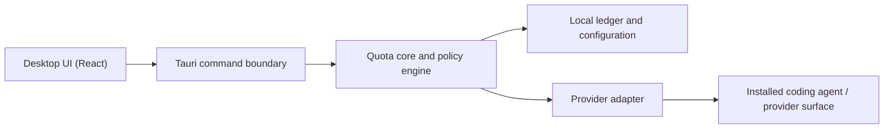

# Agent Quota Manager

Local-first quota allocation and enforcement for coding-agent subscriptions.

> [!IMPORTANT]
> Agent Quota Manager is an early local MVP with no stable release. Codex quota
> discovery and manual allocation work locally, but continuous reconciliation
> and managed enforcement are not implemented yet.

Coding-agent subscriptions usually expose one shared usage allowance. When
several repositories or tasks compete for that allowance, it is difficult to
reserve capacity for important work or see where the quota went. Agent Quota
Manager aims to make that budget explicit.

## What it is

Agent Quota Manager is a desktop application that will let a user:

- allocate a subscription's usage allowance to projects, repositories, or tasks;
- launch managed coding-agent sessions within those allocations;
- stop, warn, or require confirmation when a scope reaches its limit;
- reconcile observed provider usage with locally attributed usage; and
- manage multiple providers through capability-aware adapters.

It targets subscription usage such as Codex or Claude Code allowances—not
API-key token billing. Provider quotas are not assumed to be token counts or
interchangeable currencies.

## Product principles

- **Local first:** policy, attribution, and project data stay on the user's machine.
- **Honest accounting:** estimates and provider-confirmed values are clearly distinguished.
- **Project scoped:** repositories and tasks receive explicit, reviewable allocations.
- **Capability aware:** the UI only promises controls a provider adapter can actually enforce.
- **Provider neutral, Codex first:** the core model is generic, while integrations ship one at a time.

## Planned v0.1 scope

| Area | Initial scope |
| --- | --- |
| Provider | Codex |
| Allocation | Weekly quota by repository/project |
| Sessions | Start a managed session from the desktop app |
| Enforcement | Warning and hard-stop policies where the adapter permits |
| Accounting | Local ledger plus provider reconciliation |
| Storage | Local database; no hosted account required |

Support for additional subscription agents will follow the adapter contract,
not a lowest-common-denominator claim that every provider works identically.

## Architecture at a glance



The first release is intentionally a modular monolith. A background daemon and
standalone CLI can be extracted when managed sessions or multiple frontends
require them. See [Architecture](docs/architecture.md),
[Quota model](docs/quota-model.md), and
[Provider adapters](docs/provider-adapters.md). The implemented SQLite layer is
described in [Storage](docs/storage.md), and use-case orchestration in
[Application services](docs/application-services.md). The desktop IPC contract
is documented in [Tauri commands](docs/tauri-commands.md). See
[Local MVP](docs/local-mvp.md) for the current end-to-end workflow and its
limitations.

### Codex detection

When Codex is installed and signed in with a ChatGPT subscription, onboarding
starts its official local App Server and calls `account/rateLimits/read`. The
adapter imports the selected quota window, reset time, normalized percentage,
and current provider-confirmed usage. Manual setup remains available when
detection is unsupported or temporarily unavailable.

The app does not read Codex credential files, session transcripts, prompts, or
repository contents. The App Server process is stopped after the snapshot is
read. The selected Codex source refreshes on startup and on demand. Provider
totals replace the previous snapshot rather than accumulating as usage events,
and a new reset window carries allocations forward without old usage.

## Development

### Prerequisites

- Node.js 22 or newer
- npm 10 or newer (included with Node.js)
- stable Rust toolchain
- Tauri 2 platform prerequisites for your operating system

### Run locally

```bash
npm install
npm run tauri -- dev
```

### Validate a change

```bash
npm run check
```

This builds the frontend, checks Rust formatting and compilation, runs Clippy
with warnings denied, and runs the Rust tests.

## Contributing

The project is early, so design changes are easiest to discuss before a large
implementation. Read [CONTRIBUTING.md](CONTRIBUTING.md) before opening a pull
request. Please report vulnerabilities according to [SECURITY.md](SECURITY.md).

## License

Licensed under the [Apache License 2.0](LICENSE).
