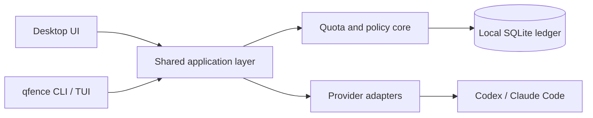

<div align="center">
  
  <h1>QuotaFence</h1>
  <p><strong>Allocate and protect AI coding-agent quota by project.</strong></p>
  <p>A local-first desktop app and terminal UI for Codex and Claude Code.</p>

  [](https://github.com/quotafence/quotafence/actions/workflows/ci.yml)
  [](LICENSE)
  [](docs/beta.md)
</div>

> [!WARNING]
> QuotaFence is beta software. Downloadable builds are unsigned; macOS builds
> are ad-hoc signed but not notarized. Verify the supplied checksum before
> bypassing Gatekeeper or SmartScreen, and do not rely on QuotaFence as the only
> safeguard for critical quota.

## Why QuotaFence?

AI coding subscriptions usually expose one shared allowance for every project.
A long low-priority task can consume the capacity intended for important work,
while provider dashboards cannot explain which folder used it.

QuotaFence adds a local control layer:

1. **Observe** provider-confirmed 5-hour and weekly allowance windows.
2. **Allocate** weekly quota to folders without limiting the number of projects.
3. **Enforce** those budgets before new managed or verified-hook work starts.

Prompts, source code, transcripts, and credentials are not uploaded to a
QuotaFence service. The free core works without an account or cloud backend.

## What you get

| | Capability |
| --- | --- |
| 📊 | One dashboard for Codex and Claude Code allowance windows |
| 📁 | Weekly budgets attached to local project folders |
| 🛡️ | Soft warnings and hard local admission boundaries |
| ↕️ | Priority ordering when remaining quota cannot fund every project |
| 🧭 | Attribution from managed sessions and supported desktop activity signals |
| 🕘 | Six months of basic local usage history |
| ⌨️ | `qfence` CLI plus an interactive terminal dashboard |
| 🔒 | Local SQLite storage with no prompt or source-code collection |

## Platform support

| Platform | Desktop app | CLI/TUI | Status |
| --- | --- | --- | --- |
| macOS Apple silicon and Intel | Universal DMG | Universal binary | Beta; ad-hoc signed, not notarized |
| Windows x64 | NSIS installer | Native x64 binary | Preview; unsigned |
| GNU/Linux x64 | AppImage and Debian package | Native x64 binary | Preview; unsigned |

ARM64 Windows/Linux and musl/Alpine packages are not published yet.

## Provider support

| Provider | Allowance sync | Project allocation | Managed CLI | Desktop prompt gate |
| --- | --- | --- | --- | --- |
| Codex | 5-hour + weekly | Weekly | Beta | Beta |
| Claude Code | 5-hour + weekly | Weekly | Beta | Beta |

Availability depends on the provider client, account type, and quota windows
returned for that account. QuotaFence never invents a missing window or converts
context usage into subscription usage.

## Install the beta

Download QuotaFence from [GitHub Releases](https://github.com/quotafence/quotafence/releases):

| Platform | Install the desktop app |
| --- | --- |
| macOS | Open the universal `.dmg` and drag QuotaFence to Applications |
| Windows x64 | Run the `windows-x64-setup.exe` installer |
| GNU/Linux x64 | Run the `.AppImage`, or install the `.deb` on Debian-based systems |

### CLI via npm (recommended)

Install the native CLI and terminal dashboard on supported platforms:

```bash
npm install --global @quotafence/cli@beta
qfence status
```

The `@beta` suffix is intentional while QuotaFence is prerelease software.

### Standalone CLI archive

If you do not use Node.js/npm, extract the matching `quotafence-cli-*` archive
from GitHub Releases and run:

```bash
# macOS or Linux
./install-cli.sh ./qfence
qfence status
```

On Windows, open PowerShell in the extracted CLI directory:

```powershell
Set-ExecutionPolicy -Scope Process Bypass
.\install-cli.ps1
qfence status
```

A Homebrew tap/cask is planned separately.

### Verify a download

The commands below do not install QuotaFence. They compare downloaded files
with the release checksum before you open an unsigned beta installer:

```bash
# macOS
shasum -a 256 -c SHA256SUMS.txt

# Linux
sha256sum --check SHA256SUMS.txt
```

On Windows, use the PowerShell verification command in the
[installation guide](docs/installing.md#verify-the-artifact).

See the full [install, verification, upgrade, and removal guide](docs/installing.md)
for Gatekeeper, SmartScreen, PATH, and uninstall instructions.

## Five-minute setup

1. Open QuotaFence and add a detected Codex or Claude Code source.
2. Sync and confirm that percentages and reset times match the provider.
3. Choose a project folder and assign part of the provider's weekly quota.
4. Reorder projects to decide which budgets are protected first.
5. Enable the provider integration from **Settings**, follow its trust steps,
   send one test prompt, and run **Check now**.

QuotaFence distinguishes **installed** from **verified** protection. Existing
Codex tasks cannot attach a newly installed prompt hook; create or use a task
after setup and send a prompt before expecting the health panel to turn green.

Read the [beta guide](docs/beta.md) before using hard limits for important work.

## CLI and terminal dashboard

`qfence` is the recommended command. `quotafence` remains an equivalent alias.

```bash
qfence status              # refresh and show all allowances
qfence sync                # force a provider checkpoint refresh
qfence top                 # open the interactive terminal dashboard
qfence history             # show basic local usage history
qfence allocations         # list weekly project budgets
qfence codex               # launch a managed Codex session
qfence claude              # launch a managed Claude session
```

Create or resize an allocation without opening the desktop app:

```bash
qfence allocations add --provider codex --percent 20
qfence allocations set "Client project" --percent 30 --from "Main project"
qfence allocations move "Client project" up
```

The TUI supports adding, editing, deleting, and reprioritizing allocations.
Run `qfence help` or read the complete [CLI and TUI guide](docs/cli.md).

## How enforcement works

Allocations are percentages of a provider's full **weekly** window, not of the
amount currently remaining. Native 5-hour windows stay provider-level safety
limits.

The highest-priority project is funded first. If external usage reduces the
remaining weekly allowance, QuotaFence removes protection from lower-priority
projects before higher-priority projects. It can refuse a new managed launch or
a new prompt observed through a verified provider hook; it does not terminate a
turn already running.

Managed sessions can be attributed directly. Desktop attribution uses minimal
local activity metadata and assigns an aggregate provider delta only when the
active folder is unambiguous. Concurrent or unmapped activity remains
explicitly unattributed.

## Privacy boundary

QuotaFence stores configuration, provider checkpoints, allocations, and basic
usage history locally. It does **not** intentionally collect or upload:

- prompts or assistant responses;
- source files or repository contents;
- conversation transcripts;
- provider credentials; or
- the local QuotaFence database.

Provider authorization material required for a refresh is kept in memory and
is not persisted by QuotaFence. Optional sync and paid cloud coordination are
not part of this beta.

See [Security](SECURITY.md), [Storage](docs/storage.md), and the
[provider capability matrix](docs/provider-capability-matrix.md) for details.

## Known beta limitations

- Installers are not production-signed or notarized.
- Windows and Linux builds are Preview quality and currently x64 only.
- Exact subscription token usage by folder is not exposed by providers.
- External or concurrent activity may remain unattributed.
- Hooks protect new work; they do not stop an already-running turn.
- Downgrading the local database is not guaranteed.
- Cloud sync, teams, billing, and automatic cross-provider routing are not
  implemented.

Use the matching form under
[New issue](https://github.com/quotafence/quotafence/issues/new/choose) for an
installation, sync, false-block, or attribution problem. Never attach
credentials, prompts, transcripts, source code, or the QuotaFence database.

## Build from source

### Prerequisites

- Node.js 22 or newer
- npm 10 or newer
- stable Rust toolchain
- [Tauri 2 prerequisites](https://v2.tauri.app/start/prerequisites/) for your OS

Windows contributors should also read the [Windows setup guide](docs/windows.md);
Linux contributors should read the [Linux guide](docs/linux.md).

```bash
git clone https://github.com/quotafence/quotafence.git
cd quotafence
npm install
npm run tauri -- dev
```

Run the CLI directly from source:

```bash
npm run qfence -- status
npm run qfence -- top
```

Validate a change:

```bash
npm run check
```

This checks release-version alignment and npm packaging, builds the frontend,
formats and lints Rust with warnings denied, and runs the Rust test suite.

## Architecture



The desktop app and CLI share the same Rust application, policy, provider, and
storage layers. The current release is a modular monolith; it does not require
a daemon or hosted service.

Start with [Architecture](docs/architecture.md), [Quota model](docs/quota-model.md),
and [Application services](docs/application-services.md) for implementation
details.

## Documentation

| Guide | Audience |
| --- | --- |
| [Beta guide](docs/beta.md) | Everyone evaluating the beta |
| [Installing and removing](docs/installing.md) | Desktop and CLI users |
| [CLI and TUI](docs/cli.md) | Terminal users |
| [Windows](docs/windows.md) | Windows users and contributors |
| [Linux](docs/linux.md) | Linux users and contributors |
| [Roadmap](docs/roadmap.md) | Product direction and remaining work |
| [Architecture](docs/architecture.md) | Contributors |
| [Security policy](SECURITY.md) | Vulnerability reporters |

Project quotas and local enforcement are part of the open-source core. Future
commercial capabilities are intended for advanced analytics, automation, and
optional multi-device or team coordination—not project-count paywalls. See the
[product direction](docs/product-and-monetization.md).

## Contributing

QuotaFence is early, so discuss large design changes before implementing them.
Read [CONTRIBUTING.md](CONTRIBUTING.md), then open an issue or pull request.
Private vulnerability reports must follow [SECURITY.md](SECURITY.md).

## License

QuotaFence is licensed under the [Apache License 2.0](LICENSE).

Codex, OpenAI, Claude, Anthropic, and their associated marks belong to their
respective owners. QuotaFence is an independent project and is not affiliated
with or endorsed by those providers.
